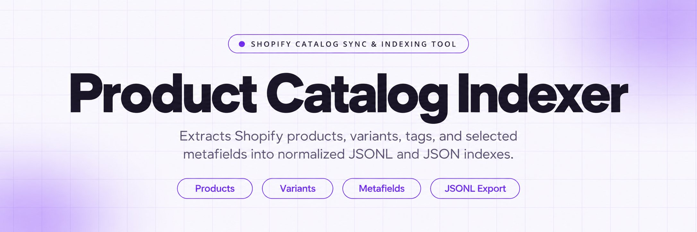
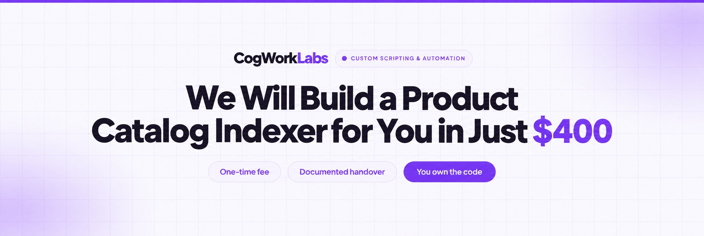
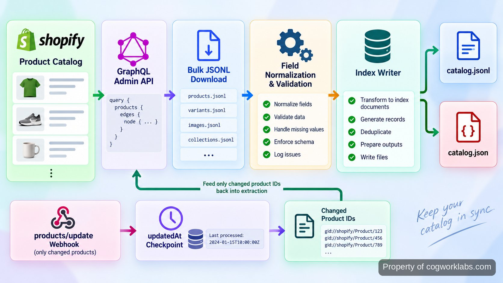

<p align="center">
  <a href="https://www.cogworklabs.com" target="_blank" rel="nofollow">
    
  </a>
</p>

## CogWorkLabs' Shopify Product Indexer

CogWorkLabs' Shopify Product Indexer is a repository-ready catalog extraction and indexing system for stores that need product data outside Shopify without turning every downstream consumer into an API client. It reads the catalog through Shopify’s <a href="https://shopify.dev/docs/api/admin-graphql/latest" target="_blank" rel="nofollow">GraphQL Admin API</a>, flattens the fields a search engine or internal service actually needs, and writes a deterministic local index. Full runs establish a clean baseline; incremental runs update only changed records. The point is not another storefront. It is a controlled boundary between Shopify’s product model and whatever needs a stable product dataset next.

For Custom Scripting & Automation work, builds START at $400. Scope moves with the catalog shape, the fields that must be preserved, and the destination that consumes the index; the repository itself stays focused on one job: collecting, normalizing, validating, and publishing product records.

<a href="https://www.cogworklabs.com" target="_blank" rel="nofollow">
  
</a>

<p align="center">
  <a href="https://t.me/Bitbash333" target="_blank" rel="nofollow">
    
  </a>&nbsp;
  <a href="https://wa.me/923249868488?text=Hi%2C%20I%27m%20interested%20in%20CogWorkLabs." target="_blank" rel="nofollow">
    
  </a>&nbsp;
  <a href="mailto:hello@cogworklabs.com" target="_blank" rel="nofollow">
    
  </a>&nbsp;
  <a href="https://www.cogworklabs.com" target="_blank" rel="nofollow">
    
  </a>
</p>

## What the catalog index contains

A useful index is smaller and more regular than the source model. Shopify products can carry titles, handles, status, options, variants, media, SEO fields, collections, and custom <a href="https://shopify.dev/docs/api/admin-graphql/latest/objects/Metafield" target="_blank" rel="nofollow">metafields</a>. The indexer selects only configured fields, then produces one normalized product record with stable keys. Variants remain attached to their parent product so price, SKU, barcode, availability, and option values can be searched without reconstructing relationships later.

Consider a product named `Trail Bottle 750ml` with handle `trail-bottle-750`, vendor `North Ridge`, and variant SKU `TB-750-BLK`. Shopify returns nested GraphQL nodes; the index writes a record whose product ID, handle, title, vendor, tags, variant identifiers, prices, image references, and selected metafields always occupy the same locations. Missing optional fields become null or empty arrays rather than silently changing the schema. That matters when the consumer is a search index, recommendation service, reporting script, or retrieval pipeline that should not contain Shopify-specific traversal logic.

## Full sync, normalization, and incremental refresh

The product catalog sync follows four stages. A full run submits a Shopify <a href="https://shopify.dev/docs/api/usage/bulk-operations/queries" target="_blank" rel="nofollow">bulk query</a> for products and nested variants, waits for completion, downloads the JSONL result, and transforms each line into the repository’s index schema. Normalization then removes presentation-only nesting, converts identifiers to stable strings, preserves configured metafields, and sorts multi-value fields where ordering has no business meaning.

After the baseline exists, incremental catalog updates use `updatedAt` as a checkpoint and can be paired with <a href="https://shopify.dev/docs/apps/build/events-webhooks" target="_blank" rel="nofollow">product update webhooks</a> to identify records that need refreshing. A delete path removes records that no longer exist or are intentionally excluded by status. Checkpoints advance only after the new index is written successfully, so a failed run is replayable instead of skipping changes. :contentReference[oaicite:0]{index=0}



## Core features

| Feature | Description |
| --- | --- |
| Bulk product export | Large catalogs should not require thousands of hand-managed page requests. The full sync uses Shopify bulk operations to retrieve product and variant data asynchronously and consume the resulting JSONL file. |
| Configured field projection | Downstream systems should not inherit every field Shopify can return. A field map controls product, variant, media, tag, and metafield selection before records reach the index. |
| Product data normalization | Nested API payloads create repeated parsing work. The transformer emits one predictable record shape, normalizes missing values, and keeps parent-product and variant relationships explicit. |
| Incremental catalog updates | Rebuilding an unchanged catalog wastes API capacity and compute. Checkpoints and changed product IDs limit refresh work to records updated since the last successful publication. |
| Webhook-driven indexing | Polling alone can leave avoidable lag. Product update events can enqueue a targeted refresh while the checkpoint remains the recovery path for missed or delayed deliveries. |
| Atomic index publication | A partial file should never become the live dataset. New output is written to a temporary path, validated, then renamed into place only after the run completes. |

## Output contracts rather than Shopify-shaped payloads

The repository publishes JSONL for streaming consumers and JSON for tools that prefer a single document. JSONL is the safer default for bulk product export because a consumer can process records one at a time without loading the entire catalog into memory. Each record carries a source product ID, a canonical handle, timestamps, a product-level text bundle, selected taxonomy fields, variant objects, and a `source_hash` used to detect unchanged normalized content.

```json
{"id":"gid://shopify/Product/1001","handle":"trail-bottle-750","title":"Trail Bottle 750ml","vendor":"North Ridge","tags":["bottle","trail"],"variants":[{"sku":"TB-750-BLK","price":"29.00","options":{"Color":"Black"}}],"source_hash":"sha256:..."}
```

Validation runs before publication. A product without an ID is rejected because it cannot be updated safely; duplicate product IDs stop the run; malformed variant arrays are reported with the source line number. Optional merchandising fields can be absent without failing the job. This distinction keeps data quality rules attached to identity and structure rather than treating every empty description or missing image as a broken product.

<a href="https://tally.so/r/b5QYLL?platform=GitHub&amp;format=Product+repo&amp;brand=CogWorkLabs&amp;niche=automation&amp;page=Shopify+Product+Indexer+using+Admin+API&amp;date=2026-09-07" target="_blank" rel="nofollow">
  
</a>

## Tech stack, API limits, and failure handling

| Component | Why it is here |
| --- | --- |
| Python CLI | A small command surface suits scheduled jobs, local runs, and container execution without requiring a web UI. |
| GraphQL Admin API | Field selection keeps catalog reads explicit, and one schema covers products, variants, media, and metafields. |
| Shopify bulk operations | Asynchronous catalog extraction avoids hand-built pagination loops for full exports and leaves normal API capacity available. |
| JSONL index | Line-oriented output lets downstream jobs stream records, retry individual lines, and process large files without loading the whole catalog. |

The system is built around the behavior Shopify documents, not a fixed request-per-minute assumption. The <a href="https://shopify.dev/docs/api/usage/limits" target="_blank" rel="nofollow">API limits reference</a> gives the standard GraphQL Admin API a calculated budget of 100 points per second, with higher limits on higher plans. Full extraction therefore uses asynchronous bulk operations instead of trying to win a pagination race against the throttle. In API versions 2026-01 and later, Shopify permits up to five concurrent bulk query operations per shop; bulk queries must finish within 10 days. :contentReference[oaicite:1]{index=1}

Failure handling is deliberately boring. Authentication and permission errors stop immediately. Rate-limit responses use the returned cost information and retry after capacity is available. Bulk operations are polled by operation ID or completed by event, and Shopify’s downloadable bulk result URLs expire after seven days, so the result is copied into the run workspace as soon as completion is confirmed. The selected API version is explicit because Shopify follows a quarterly <a href="https://shopify.dev/docs/api/usage/versioning" target="_blank" rel="nofollow">versioning schedule</a>; version changes are tested against the field projection before deployment. :contentReference[oaicite:2]{index=2}

## Repository layout and run path

The code is split by responsibility so changes to Shopify queries do not rewrite output logic. `shopify/` owns authentication, GraphQL, bulk-operation state, and webhook verification. `index/` owns normalization, validation, hashing, and publication. `state/` stores the last successful checkpoint. The CLI wires those parts together and exposes full and incremental modes.

```text
shopify-product-index/
├── src/
│   ├── cli.py
│   ├── config.py
│   ├── shopify/
│   │   ├── client.py
│   │   ├── queries.py
│   │   ├── bulk.py
│   │   └── webhooks.py
│   ├── index/
│   │   ├── normalize.py
│   │   ├── validate.py
│   │   ├── hashing.py
│   │   └── writer.py
│   └── state/
│       └── checkpoint.py
├── tests/
│   ├── fixtures/
│   │   └── bulk-products.jsonl
│   ├── test_normalize.py
│   ├── test_validate.py
│   └── test_checkpoint.py
├── .env.example
├── pyproject.toml
└── README.md
```

```bash
python -m src.cli sync --mode full --output ./data/catalog.jsonl
python -m src.cli sync --mode incremental --output ./data/catalog.jsonl
```

A full command creates the baseline file and checkpoint. The incremental command reads that checkpoint, refreshes changed products, merges them by product ID, validates the result, and atomically replaces the previous file. Exit code `0` means the new index was published; a nonzero code leaves the previous index untouched and writes the failing stage to stderr.

## How to Index a Catalog Using CogWorkLabs' Shopify Product Indexer

- **STEP 1 — Download & Set Up the Project** — Download CogWorkLabs' Shopify Product Indexer from this repository, install the <a href="https://docs.python.org/3/" target="_blank" rel="nofollow">Python</a> dependencies, copy `.env.example` to `.env`, then add the shop domain and Admin API access token.
- **STEP 2 — Check the Field Map** — Open the configuration and confirm which product, variant, media, tag, and metafield values belong in the downstream index.
- **STEP 3 — Run the Baseline** — Execute `python -m src.cli sync --mode full --output ./data/catalog.jsonl`; the CLI submits the bulk query and validates the normalized result.
- **STEP 4 — Refresh Changed Products** — Run incremental mode on schedule or from queued product events; the command merges changed records and publishes the replacement index atomically.

## Use Cases

- **Storefront search:** ingest normalized titles, tags, variants, images, and selected metafields without teaching the search service Shopify authentication or pagination.
- **Merchandising audits:** scan the index for missing SKUs, absent images, incomplete tags, or required custom attributes before those gaps surface in browse and search.
- **Retrieval and AI pipelines:** build embeddings from the product text bundle while retaining product IDs, handles, prices, and variant facts as structured metadata.
- **Catalog change reporting:** diff successive index files by product ID and `source_hash` to show which normalized records changed between successful runs.

That separation also makes failures easier to reason about. Baymard’s research on <a href="https://baymard.com/research/ecommerce-product-lists" target="_blank" rel="nofollow">product-list usability</a> documents more than 700 product-list, filtering, and sorting issues found in testing, while its <a href="https://baymard.com/research/product-page" target="_blank" rel="nofollow">product-page research</a> reports more than 1,300 product-page usability issues. An index does not fix interface design, but it gives search and merchandising systems consistent source data so those layers can be tested independently rather than mixing catalog extraction defects with presentation defects. :contentReference[oaicite:3]{index=3}

## FAQ

### Does the indexer change products in Shopify?

No. The indexing path is read-oriented: it extracts configured product data, normalizes it, and writes local index files. Product writes are not part of the run path, so a failed transformation cannot overwrite titles, variants, prices, or metafields in the store.

### How does it handle large catalogs and API limits?

Full runs use Shopify bulk queries rather than manually paging through the catalog, then download the completed JSONL result for local processing. Incremental runs reduce repeat work by refreshing changed records, while retries respect GraphQL query-cost limits and the previous published index remains available if a run fails.

### Can the indexed output feed search, AI, or another internal system?

Yes. The output is deliberately consumer-neutral: JSONL supports streaming ingestion and JSON supports tools that prefer one document. Search services can use normalized text and facets, retrieval systems can add embeddings downstream, and internal scripts can read stable product and variant fields without calling Shopify directly.